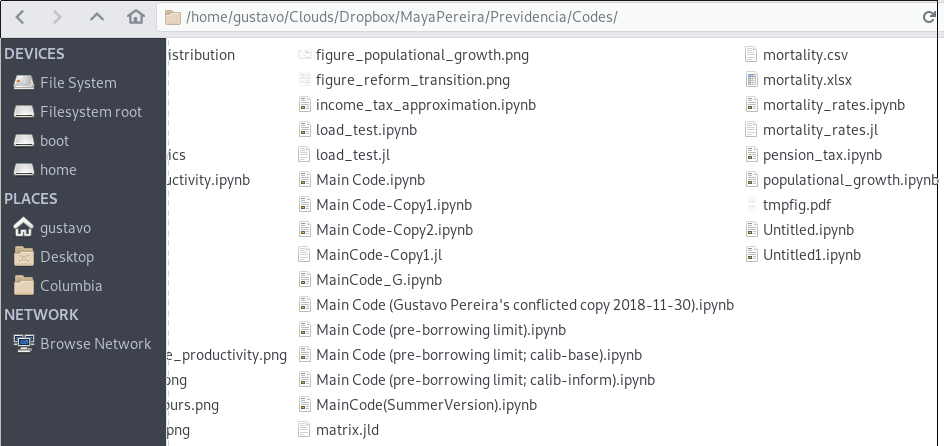

# Introduction

## About me
* Economics Ph.D. student, 4th year
* *Not* a specialist in: 
  1. Teaching
  2. Git
  
  
::: notes
Hello everyone! For those of you who don't know me, my name
is Gustavo and I'm currently in the fourth year of the PhD in economics. This
workshop will focus on how to apply the Git philosophy to teaching.

Now, let me warn you that I've been using git for only two years. And while
learning it has been a useful process, I'm far from "Git wizard". I would even
guess that some of you here in this audience know it better than me.

With that in mind, please don't think of this as a session of me teaching you
stuff. Feel free to interrupt me whenever, make suggestions, comments, etc.
Let's think of this more as a brainstorm.
:::
   
## Purpose of this talk
* Inspire you to adopt Git for:
    1. Your own work
    2. Collaborating
    3. Teaching
* Introduce basic Git concepts (if time allows...)

::: notes
I have only 30 minutes, so I can't go beyond touching the surface. What I hope
to achieve with this talk is to 

1. Show you how git can be useful for collaborating, teaching, **and for your own research**
2. Introduce some jargon and concepts that will help you learn git
:::

# Why do I care?
* Most of us are *not* programmers, but still **rely a lot on coding** 
* Programmers have been coding *extensively* and *collaboratively* for decades
* Most of us aren't aware of the best practices for that

::: notes
* Let me wear what in Portuguese will call the "sandals of humility"
* I'll show you the files in a joint project with my co-author
* Warning: there's some extreme graphical content coming up. 
:::

## How an economist does version control


::: notes
* You will see that there are many "MainCode.ipynb" files with different
  suffixes for different versions
* Sometimes there is a chronological logic (pre-borrowing limit)
* Other times there are different calibrations
   - This is because some things are coded with global variables
   - So this is actually a mix of bad version control and bad programming

So this is where most of you will think: "these guys is just stupid. I have a
much better version control system" 
:::

## How an economist does version control
* There are obvious improvements to what I showed you
* Example: 
  ```
   DatabaseExtraction-2018-07-21.do
   DatabaseExtraction-2018-08-02.do
   RunRegressions-ver1.do
   RunRegression-ver2-final.do
   RunRegression-ver2-REALLYfinal.do
  ```

::: notes
So even if you're a smart-ass, here's a typical case. 
* You begin by attaching dates
* Then you get tired, and start doing versions
* Then you start saying things are final, then really final
:::

## How an economist does version control
### Why is this bad practice
* Changes aren't documented
* Not systematic: when do you create a new version?
* How do two people work together under that system?


# The Git approach


## The Git approach
1. Keep track of project "snapshots"

   > "Every time you *commit* (...) it (...) takes a picture of what all your
   > files look like at that moment and stores a reference to that snapshot."
   [extracted from the git documentation]

The process of updating snapshots is called **committing** your changes

## The Git approach
2. Keep changes from one snapshot to the next **simple** and **documented**

Corollary: commit **often**

<!-- ## The Git approach -->
<!-- 3. Adopt a branching workflow  -->

<!-- There are several approaches for dealing with conflicts. Adopt one of them -->

<!-- [Check the git documentation](https://git-scm.com/book/en/v2/Git-Branching-Branching-Workflows) -->

## The Git approach
3. Prioritize things in **plain text**

   That is: 

   - Commit changes to code, LaTeX, Markdown... (generators, light)
   - Do not track PDF, PNG, CSV, etc... (derivatives, heavier)
   
::: notes
The rule I use is: 

- If somehting is an *input*, keep track even if it's a binary/csv/etc
    * That is, sometimes you need these files for the code to run
    * In that case, you must keep track of them 
- If something is an output, keep track only if it's absolutely essential
:::

## The Git approach

### Example
I'll show you how Git implements these principles, and why they make sense


